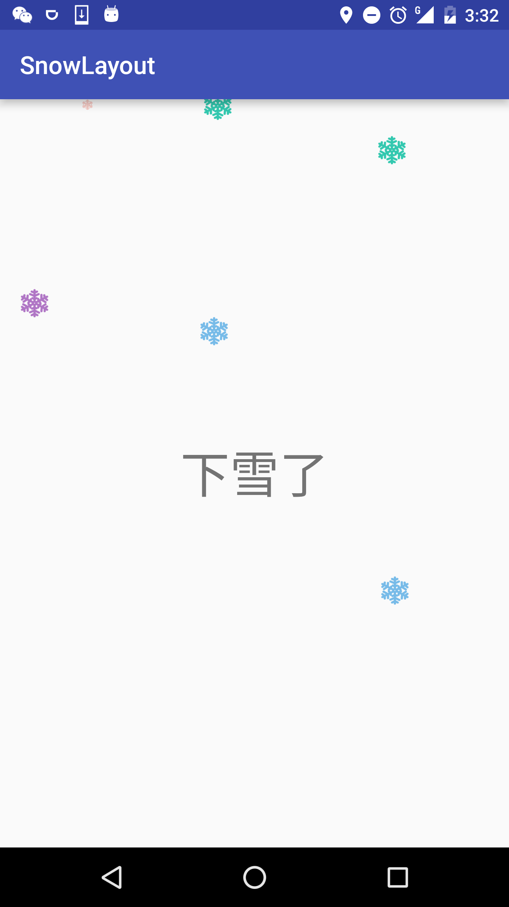

#SnowLayout

---


---

> 昨天看了徐医生的[费塞尔曲线艺术](https://github.com/xuyisheng/BezierArt)，然后把上面的例子手打了一遍，受益匪浅.下面的下雪的效果的Layout就是根据费塞尔三阶曲线画出的轨迹.

---
#How to
---
**Step 1.**  Add the JitPack repository to your build file
Add it in your root build.gradle at the end of repositories:
```
	allprojects {
		repositories {
			...
			maven { url "https://jitpack.io" }
		}
	}
```
---
**Step 2.** Add the dependency
```
	dependencies {
	        compile 'com.github.shellljx:SnowLayout:v1.0'
	}
```
---
**Step 3.**
```language-java
        mSnowLayout = (SnowLayout) findViewById(R.id.snowLayout);
        mDrawables[0] = ContextCompat.getDrawable(this, R.mipmap.ic_snow1);
        mDrawables[1] = ContextCompat.getDrawable(this, R.mipmap.ic_snow2);
        mDrawables[2] = ContextCompat.getDrawable(this, R.mipmap.ic_snow3);
        mDrawables[3] = ContextCompat.getDrawable(this, R.mipmap.ic_snow4);
        mDrawables[4] = ContextCompat.getDrawable(this, R.mipmap.ic_snow5);
        mDrawables[5] = ContextCompat.getDrawable(this, R.mipmap.ic_snow6);
        mSnowLayout.setDrawables(mDrawables);
        mSnowLayout.start();
```


